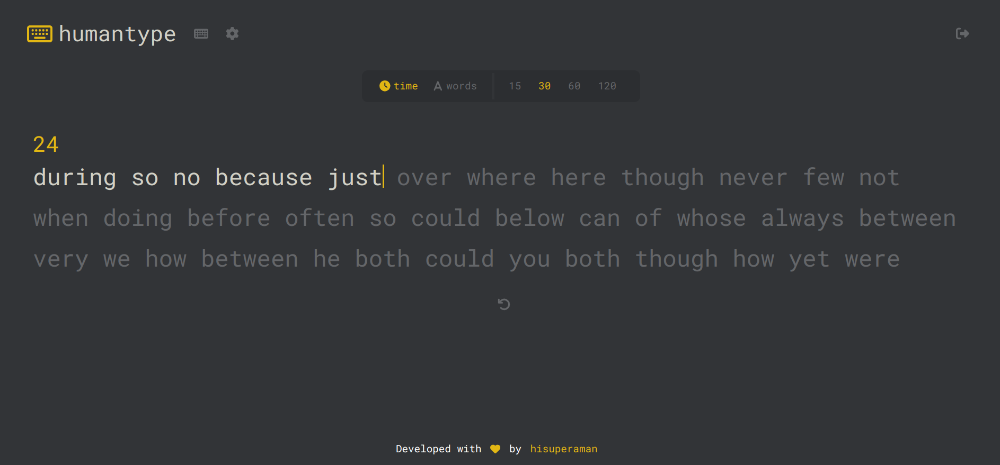

# HumanType

## Description

This is a clone of MonkeyType typing test website.

## Features

- Two modes: time and words
- Responsive user interface

## Screenshots

### Home Page


## Tech Stack

- **React.js**: Frontend user interface

## Installation

1. Clone the repository:
   ```bash
   git clone https://github.com/hisuperaman/humantype.git .
2. Install dependencies:
    ```bash
    npm install
## Running the Project
1. Start Vite server
    ```bash
    npm run dev
## Contributing

Contributions are welcome! Feel free to submit a pull request or open an issue.

## License

This project is licensed under the MIT License.